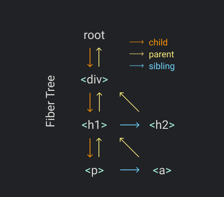

之前学习React的时候看到一篇文章《Build Your Own React》, 不论从质量还是更新速度上, 都非常的不错, 现将它翻译一下, 同时也加深自己对React的理解. 感兴趣的朋友可以进入 [传送门](https://pomb.us/build-your-own-react/) 查看原文. 

正文开始

[toc]

# 第零步: 知识回顾

首先我们来回顾一下React的一些基本概念. 如果你已经对React, JSX和DOM元素之间是如何交互的有了较好的理解, 那么可以跳过这一步.

我们使用这个仅有三行代码的React应用小程序. 第一行代码定义了一个React元素, 第二行代码使用原生Js得到一个DOM节点, 最后一行代码将React元素渲染到container容器中.

**我们用最普通的Js来替换掉所有React特有的代码**

```js
const element = <h1 title="foo">Hello</h1>
const container = document.getElementById("root")
ReactDOM.render(element, container)
```

第一行代码是用JSX定义的React元素, 这根本不是合法的Js. 为了将代码转换为纯Js, 我们首先将它替换成合法的Js代码.

JSX可以通过Babel等构件工具转换成Js. 转换过程通常也比较简单, 就是将标签内容整个替换为调用`createElement`函数, 然后将标签名, `props`属性和`children`属性作为参数传进去.

```js
const element = React.createElement(
  "h1",
  { title: "foo" },
  "Hello"
)
```

`React.createElement`根据传入的参数创建一个对象. 源码中无非就是多了一些验证操作, 所以我们直接把结果拿过来替换掉这个函数没有任何问题.

```js
const element = {
  type: "h1",
  props: {
    title: "foo",
    children: "Hello",
  },
}
```

这就是一个React元素, 它就是一个有type和props属性的对象(当然源码中肯定有更多属性, 但是我们只关心这两个).

`type`属性的值是一个字符串, 它指定了我们想要创建的DOM节点的类型, 它就是你想要创建HTML元素时传入`document.createElement`函数的元素标签名. `type`属性也可以是一个函数, 这个我们留到第七步再讲.

`props`属性是一个对象, 它的内容都从JSX代码中的attributes(HTML中书写的属性叫做attributes)得来, 它还有一个比较特殊的属性`children`.

在这个例子中, `children`是一个字符串, 但是通常情况下它是一个数组.

另外一个我们需要替换的React代码是`ReactDOM.render`. render是React更改DOM的地方, 所以现在改为由我们自己来做对DOM的操作.

首先我们用`type`指定元素类型来创建一个节点, 也就是h1元素. 然后再将所有的`props`属性添加到节点中, 这里我们仅有title属性.

*为了避免混淆, 下文中的"元素"指的是React元素, "节点"指DOM元素.*

接下来我们为children创建节点. 由于我们的children只是一个字符串, 所以我们创建文本节点.

```js
const node = document.createElement(element.type)
node["title"] = element.props.title
​
const text = document.createTextNode("")
text["nodeValue"] = element.props.children
```

之所以要创建textNode而不是去设置某元素的innerText, 是因为这样可以使我们在将来可以以一种相同的方式来处理所有的元素. 同样需要注意到, 我们设置`nodeValue`的方式也是跟我们设置h1的`title`属性是一样的, 这就好像字符串也有一个属性`props: {nodeValue: "hello"}`.

最后, 我们把文本节点挂载到h1上, 然后把h1元素挂载到容器container上. 现在我们的程序就跟之前有一样的效果了.

```js
const element = {
  type: "h1",
  props: {
    title: "foo",
    children: "Hello",
  },
}
​
const container = document.getElementById("root")
​
const node = document.createElement(element.type)
node["title"] = element.props.title
​
const text = document.createTextNode("")
text["nodeValue"] = element.props.children
​
node.appendChild(text)
container.appendChild(node)
```

# 第一步: 搞定createElement函数

这次我们重新整一个程序, 而且要用我们自己的React来替换官方的React. 我们从重写createElement函数开始.

首先还是把JSX转换成Js, 来瞅一眼官方是怎么调用createElemnt的.

```js
const element = React.createElement(
  "div",
  { id: "foo" },
  React.createElement("a", null, "bar"),
  React.createElement("b")
)
const container = document.getElementById("root")
ReactDOM.render(element, container)
```

从上一步中我们看到了一个React元素其实就是一个有`type`和`props`属性的对象. 我们自己的createElement函数要做事也就是创建这么一个对象.

```js
function createElement(type, props, ...children) {
  return {
    type,
    props: {
      ...props,
      children,
    },
  }
}
```

我们使用扩展运算符将props展开, 使用剩余参数的语法将children搜集到一起, 这样`children`属性就一定会是数组了.

例如, `createElement("div")`返回:
```js
{
  "type": "div",
  "props": { "children": [] }
}
```
`createElement("div", null, a)`返回:
```js
{
  "type": "div",
  "props": { "children": [a] }
}
```
`createElement("div", null, a, b)`返回:
```js
{
  "type": "div",
  "props": { "children": [a, b] }
}
```

`children`数组也可能包含像字符串, 数字这样的原始值. 所以, 我们将元素中所有不是对象的东西全部包裹起来, 为他们创建一个名为`TEXT_ELEMENT`的特殊类型.

*源码中, 当没有children时React并没有去创建一个空数组, 也没有包裹原始值, 但是我们偷懒了, 于是我们就是这么干了! 我们的代码就是要简单, 不需要表现多完美性能多好.*

```js
function createElement(type, props, ...children) {
  return {
    type,
    props: {
      ...props,
      children: children.map(child =>
        typeof child === "object"
          ? child
          : createTextElement(child)
      ),
    },
  }
} 
​
function createTextElement(text) {
  return {
    type: "TEXT_ELEMENT",
    props: {
      nodeValue: text,
      children: [],
    },
  }
}
```

现在的createElement还是React提供的, 为了要替换掉它, 我们还要给我们自己的库起个名字. 我们需要起个有逼格的名字, 比如Didact. 于是乎, 代码就变成了这样: 

```js
nst Didact = {
  createElement,
}
​
const element = Didact.createElement(
  "div",
  { id: "foo" },
  Didact.createElement("a", null, "bar"),
  Didact.createElement("b")
)
const container = document.getElementById("root")
ReactDOM.render(element, container)
```

但是我们仍需要使用JSX啊, 那我们怎么告诉babel使用Didact的createElement呢? 就像这样加个注释就行了.

```js
const Didact = {
  createElement,
}
​
/** @jsx Didact.createElement */
const element = (
  <div id="foo">
    <a>bar</a>
    <b />
  </div>
)

const container = document.getElementById("root")
ReactDOM.render(element, container)
```

# 第二步: 搞定render函数

接下来, 我们要来重写我们自己的ReactDOM.render函数.

目前我们只关心往DOM里头加东西, 至于怎么更新和删除后面再说.

我们先用React元素的type类型, 创建DOM节点, 然后把这个新的节点加到container容器里. 
对于子节点递归的做同样的事情. 
同时我们需要处理文本元素, 如果元素类型是`TEXT_ELEMENT`我们就要创建文本节点.
最后我们将元素属性添加到节点上.

于是大功告成, 我们就有了一个能把JSX渲染到DOM元素里的库了.
这还不赶快到[cdoesandbox](https://codesandbox.io/s/didact-2-k6rbj)装一波逼. 

```js
function render(element, container) {
  const dom =
    element.type == "TEXT_ELEMENT"
      ? document.createTextNode("")
      : document.createElement(element.type)
​
  const isProperty = key => key !== "children"
  Object.keys(element.props)
    .filter(isProperty)
    .forEach(name => {
      dom[name] = element.props[name]
    })
​
  element.props.children.forEach(child =>
    render(child, dom)
  )
​
  container.appendChild(dom)
}
```

# 第三步: 搞定并发模式

不幸的事总是来得那么突然, 我们码更多代码之前, 可能需要重构一下. 我们的递归调用有问题啊! 一旦我们开始渲染, 那么在整个元素树渲染完成前是不会罢手的. 如果元素树贼jb大, 它搞不好就会把主线程阻塞很久. 如果这个时候浏览器要处理一些高优先级的事物比如处理用户输入啊, 执行流畅的动画啊, 它就得等我们渲染完才能搞. 

因此我们需要把工作拆分成一个一个的小单元, 每个单元完成时如果浏览器有急事我们都让它能够中断渲染.

```js

let nextUnitOfWork = null
​
function workLoop(deadline) {
  let shouldYield = false
  while (nextUnitOfWork && !shouldYield) {
    nextUnitOfWork = performUnitOfWork(
      nextUnitOfWork
    )
    shouldYield = deadline.timeRemaining() < 1
  }
  requestIdleCallback(workLoop)
}
​
requestIdleCallback(workLoop)
​
function performUnitOfWork(nextUnitOfWork) {
  // TODO
}
```

我们使用`requestIdleCallback`来进行循环. 你可以把`requestIdleCallback`想象成是`setTimeout`, 区别就是它是由浏览器在主线程空闲的时候自动来执行的.

*React已经不再使用requestIdleCallback了. 它们现在使用scheduler包. 但是别想太多, 它们概念上差不多就行了.*

`requestIdleCallback`会给回调函数传入一个deadline参数. 我们可以使用它来在判断浏览器横插一脚之前我们还有多少时间来执行我们的代码. 

为了启动循环, 我们要设置第一个工作单元是啥, 然后把`performUnitOfWork`函数给码上. 这函数不仅要执行它的工作, 还要能够返回下一个工作单元. 

# 第四步: 搞定Fibers

为了能够很好的组织工作单元, 我们需要引入一种数据结构: fiber树.

每个React元素对应一个fiber, 每个fiber就是一个工作单元.

Fiber树的样子:


每一个fiber对象, 包含的属性有:

- type: 即React元素的type, 表示元素类型
- props: 即React元素的props
- parent: 父级的fiber对象
- dom: 保存了fiber对象对应的真实DOM元素
- child: 此fiber对象的第一个子元素fiber对象
- sibling: 此fiber对象的下一个相邻兄弟fiber对象

让老夫来给你们举个栗子:

假设我们要渲染一颗酱的React元素树
```js
Didact.render(
  <div>
    <h1>
      <p />
      <a />
    </h1>
    <h2 />
  </div>,
  container
)
```

在`render`中我们就需要创建根fiber并将它设置为`nextUnitOfWork`. 余下的事情就在`performUnitOfWork`函数里做. 在函数中, 针对每个fiber我们要做3件事:

1. 将元素挂载到DOM节点
2. 为元素的children创建fiber
3. 选择并返回下一个工作单元

采用这样的数据结构的一个目标就是使我们更容易的找到下一个工作单元. 因此, 每个fiber都有一个链接指向它的第一个子fiber节点, 它的下一个兄弟fiber节点, 和它的父fiber节点. 

当我们结束完一个fiber的工作时, 如果它有子元素, 那么那个fiber就是下一个工作单元.
就我们的例子来说, 当我们结束div fiber的时候, 下一个工作单元将是h1 fiber.

如果fiber没有子元素, 我们就把它的兄弟元素作为下一个工作单元. 比如, p fiber没有子元素, 因此我们在结束p之后把a fiber作为下一个工作单元.

如果fiber既没有子元素也没有兄弟元素咋整? 那我们就找它"叔", 也就是它"爹"的"兄弟". 比如a元素和h2元素.

那么如果它爹没有兄弟咋整? 我们一直往上找, 直到找到有兄弟的"爹"或者找到了根元素. 如果我们回到了根元素, 就意味着这次render的工作已经全部搞定了.

下面, 我们把上面一坨废话转换成代码. 

首先, 把`render`函数改一下.

我们把创建DOM节点的代码抽离到一个函数中, 待会要用.

在`render`函数中, 我们将`nextUnitOfWork`设置成fiber树根节点.

```js
function createDom(fiber) {
  const dom =
    fiber.type == "TEXT_ELEMENT"
      ? document.createTextNode("")
      : document.createElement(fiber.type)
​
  const isProperty = key => key !== "children"
  Object.keys(fiber.props)
    .filter(isProperty)
    .forEach(name => {
      dom[name] = fiber.props[name]
    })
​
  return dom
}

function render(element, container) {
  nextUnitOfWork = {
    dom: container,
    props: {
      children: [element],
    },
  }
}
```

这样, 当浏览器ok之后, 它就会调用`workLoop`函数. 在`performUnitOfWork`函数中, 首先我们创建新节点并挂载到DOM元素上. 我们将DOM节点保存在fiber.dom属性中. 

然后我们为每一个child创建新的fiber对象.

接着我们将它加入到fiber树中. 如果它是**第一个**子元素, 就设置它为child, 如果不是则设置为sibling. 

最后我们来寻找下一个工作单元. 首先我们找子元素, 没有的话找sibling, 再没有找它"叔", 以此类推.

那么这就是我们自己的`performUnitOfWork`函数了.

```js


function performUnitOfWork(fiber) {
  // 第一件事: 挂载到dom节点
  if (!fiber.dom) {
    fiber.dom = createDom(fiber)
  }

  if (fiber.parent) {
    fiber.parent.dom.appendChild(fiber.dom)
  }

  // 第二件事: 为fiber的children创建各自的fiber对象
  const elements = fiber.props.children
  let index = 0
  let prevSibling = null

  while (index < elements.length) {
    const element = elements[index]

    const newFiber = {
      type: element.type,
      props: element.props,
      parent: fiber,
      dom: null,
    }

    if (index === 0) {
      fiber.child = newFiber
    } else {
      prevSibling.sibling = newFiber
    }

    prevSibling = newFiber
    index++
  }

  // 返回下一个工作单元
  if (fiber.child) {
    return fiber.child
  }
  let nextFiber = fiber
  while (nextFiber) {
    if (nextFiber.sibling) {
      return nextFiber.sibling
    }
    nextFiber = nextFiber.parent
  }
}
```

# 第五步: 搞定render和commit阶段

现在我们又碰到了一个问题. 我们每次针对fiber进行操作的时候, 都会将新的节点挂载到DOM上. 然而, 浏览器是有可能在我们完成整个fiber树渲染之前中断我们这个工作过程的, 那这样的话用户岂不是能看到一个半成品界面了? 

于是乎, 我们应该将函数中变更DOM元素的代码移除.

我们把fiber树的根节点保存起来, 将它称之为`wipRoot`(work in progress root).

一旦我们完成了所有fiber创建工作, 也就是说当没有下一个工作单元返回的时候, 我们再将整个fiber树更新到真实DOM元素上.

我们把这个更新工作放在`commitRoot`函数内. 我们递归的把所有的节点挂载到真实DOM上.

```js
function commitRoot() {
  commitWork(wipRoot.child)
  currentRoot = wipRoot
  wipRoot = null
}
​
function commitWork(fiber) {
  if (!fiber) {
    return
  }
  const domParent = fiber.parent.dom
  domParent.appendChild(fiber.dom)
  commitWork(fiber.child)
  commitWork(fiber.sibling)
}
​
function render(element, container) {
  wipRoot = {
    dom: container,
    props: {
      children: [element],
    },
    alternate: currentRoot,
  }
  nextUnitOfWork = wipRoot
}
​
let nextUnitOfWork = null
let currentRoot = null
let wipRoot = null
```

# 第六步: 搞定调和(校对)Reconciliation

目前为止, 我们仅仅是往DOM上添加一些内容, 那更新和删除DOM元素咋整呢?

这就是我们现在要做的事, 我们要比较这次从render函数里接收到的元素和上次已经渲染到真实DOM里的旧fiber树之间的差异.

因此我们肯定是需要把"旧fiber树"给保存起来. 我们把它称为`currentRoot`. 啥时候来保存呢? 就在commit之后吧. 

我们同样要给每一个fiber增加一个`alternate`属性, 这个属性就指向这个fiber对应的那个"旧的fiber对象".

现在我们把`performUnitOfWork`函数中, 创建新fiber对象的那部分代码给抽离出来. 抽离到`reconcileChildren`函数里好了.

在这个函数里, 我们将新元素与旧的fiber"校对"一下. 

我们需要同时迭代旧fiber的子元素和这次想要校对的元素数组. 代码中最重要的就是while循环中的`oldFiber`和`element`. element是我们这次想要渲染到DOM中的内容, oldFiber是我们上次渲染的内容. 

我们通过比较它们俩来确定我们要不要对DOM进行更新. 

我们使用type属性来比较:

- 如果旧fiber和新元素type相同, 我们就保留这个DOM节点, 仅仅更新一下它的属性
- 如果type不同, 只有新的element, 那就说明element是新的, 我们将要创建新的DOM节点
- 如果type不同, 只有oldFiber, 那么说明这次渲染没有这个DOM节点了, 需要移除

*在校对这部分, React官方使用了key值, 来更高效的校对, 比如某个元素是不是仅仅换了个次序. 为了偷懒, 为了简单, 我们肯定是不搞这玩意儿的*

- 当旧fiber和element type相同, 我们就创建一个新的fiber对象保存旧fiber中的DOM节点, 同时也保存来自element的props属性.与此同时, 我们为fiber打上一个标签, 即`effectTag`属性, 并设置为UPDATE. 这个属性在后面的commit阶段里要用到.

- 当有新元素, 需要创建新的DOM节点时, 我们把effectTag设置为PLACEMENT

- 当需要删除节点时, 由于我们没有创建新fiber, 我们把effectTag加到旧的fiber对象上.

但是我们commit时, 我们用的是work in progress root, 是没有旧fiber的. 因此我们需要用数组保存一下要被移除的节点.

```js
function reconcileChildren(wipFiber, elements) {
  let index = 0;
  let oldFiber = wipFiber.alternate && wipFiber.alternate.child;
  let prevSibling = null;

  // 循环对比 新的elements和上一次的fiber对象
  // elements表示新传递需要render的子元素；oldFiber表示之前那次渲染后的fiber对象
  while (index < elements.length || oldFiber !== null) {

    const element = elements[index];
    let newFiber = null;

    const sameType = oldFiber && element && element.type == oldFiber.type;

    // 比较两个节点的类型
    // 1. 如果element和oldfiber的类型相同，那么保留dom，只更新属性
    // 2. 如果type不同，并且有element，那么需要新增dom
    // 3. 如果type不同，并且有oldfiber，那么需要删除原先的dom
    if (sameType) {
      newFiber = {
        type: oldFiber.type,
        props: element.props,
        dom: oldFiber.dom,
        parent: wipFiber,
        alternate: oldFiber,
        effectTag: 'UPDATE',
      };
    }
    if (element && !sameType) {
      newFiber = {
        type: element.type,
        props: element.props,
        dom: null,
        parent: wipFiber,
        alternate: null,
        effectTag: 'PLACEMENT',
      };
    }
    if (oldFiber && !sameType) {
      oldFiber.effectTag = 'DELETION';
      deletions.push(oldFiber);
    }

    // 本次比较后，下次循环的oldFiber对象，重新赋值为oldFiber的兄弟fiber对象
    if (oldFiber) {
      oldFiber = oldFiber.sibling;
    }

    // 本次比较后，将本次的fiber对象存入变量prevSibling
    // 如果是第一个子元素，那么就将它设置为上级fiber对象的child
    // 如果不是第一个子元素，那么将它挂载到上一个fiber对象的[sibling]属性上
    if (index === 0) {
      wipFiber.child = newFiber
    } else if (element) {
      prevSibling.sibling = newFiber
    }
    prevSibling = newFiber
    index++
  }
}
```
此时, `render`和`commitRoot`部分的代码为:

```js
function commitRoot() {
  deletions.forEach(commitWork)
  commitWork(wipRoot.child)
  currentRoot = wipRoot
  wipRoot = null
}

function render(element, container) {
  wipRoot = {
    dom: container,
    props: {
      children: [element],
    },
    alternate: currentRoot,
  }
  deletions = []
  nextUnitOfWork = wipRoot
}
​
let nextUnitOfWork = null
let currentRoot = null
let wipRoot = null
let deletions = null
```

接下来我们需要更改`commitWork`函数来真正的处理effectTag.

- 如果fiber对象有PLACEMENT标签, 那么就将DOM元素挂载到它的父元素上
- 如果是DELETION标签, 那么就移除这个DOM
- 如果是UPDATE标签, 我们就在原始的DOM元素上更改一下属性, 更改操作放到`updateDom`函数中

```js
function commitWork(fiber) {
  if (!fiber) {
    return
  }
  const domParent = fiber.parent.dom
  if (
    fiber.effectTag === "PLACEMENT" &&
    fiber.dom != null
  ) {
    domParent.appendChild(fiber.dom)
  } else if (
    fiber.effectTag === "UPDATE" &&
    fiber.dom != null
  ) {
    updateDom(
      fiber.dom,
      fiber.alternate.props,
      fiber.props
    )
  } else if (fiber.effectTag === "DELETION") {
    domParent.removeChild(fiber.dom)
  }
​
  commitWork(fiber.child)
  commitWork(fiber.sibling)
}
```

我们比较新旧两个fiber对象的props属性, 移除掉新fiber中已经没有了的属性, 设置新增的或者有变化的属性. 

其中一种比较特殊的属性是事件的监听函数. 因此如果属性名以"on"前缀开头, 我们就当它是事件监听函数, 特殊处理.

如果事件监听函数改变了, 我们就移除旧的, 加上新的. 

updateDom部分代码:

```js
const isEvent = key => key.startsWith("on")
const isProperty = key => key !== "children" && !isEvent(key)
const isNew = (prev, next) => key => prev[key] !== next[key]
const isGone = (prev, next) => key => !(key in next)
function updateDom(dom, prevProps, nextProps) {
	//Remove old or changed event listeners
  Object.keys(prevProps)
    .filter(isEvent)
    .filter(
      key =>
        !(key in nextProps) ||
        isNew(prevProps, nextProps)(key)
    )
    .forEach(name => {
      const eventType = name
        .toLowerCase()
        .substring(2)
      dom.removeEventListener(
        eventType,
        prevProps[name]
      )
    })
	
  // Remove old properties
  Object.keys(prevProps)
    .filter(isProperty)
    .filter(isGone(prevProps, nextProps))
    .forEach(name => {
      dom[name] = ""
    })
​
  // Set new or changed properties
  Object.keys(nextProps)
    .filter(isProperty)
    .filter(isNew(prevProps, nextProps))
    .forEach(name => {
      dom[name] = nextProps[name]
    })
	
	// Add event listeners
  Object.keys(nextProps)
    .filter(isEvent)
    .filter(isNew(prevProps, nextProps))
    .forEach(name => {
      const eventType = name
        .toLowerCase()
        .substring(2)
      dom.addEventListener(
        eventType,
        nextProps[name]
      )
    })
}
```

# 第七步: 搞定函数组件

下一步, 我们来增加对函数组件的支持. 

首先我们改一下例子, 我们使用一个返回h1元素的函数组件. 

```js
/** @jsx Didact.createElement */
function App(props) {
  return <h1>Hi {props.name}</h1>
}
const element = <App name="foo" />
const container = document.getElementById("root")
Didact.render(element, container)
```

如果把其中的JSX转换成Js: 
```js
function App(props) {
  return Didact.createElement(
    "h1",
    null,
    "Hi ",
    props.name
  )
}
const element = Didact.createElement(App, {
  name: "foo",
})
```

函数组件有两个方面是不同的:

- 由函数组件创建的fiber对象没有DOM节点
- 它的children是来自于函数的运行结果, 并不是直接来自于props

我们需要判断fiber对象的type是不是一个函数, 然后再决定使用哪个函数来处理.

在`updateHostComponent`函数中我们跟之前一样处理, 而在`updateFunctionComponent`函数中, 我们运行函数来得到children.

```js
function updateFunctionComponent(fiber) {
  const children = [fiber.type(fiber.props)]
  reconcileChildren(fiber, children)
}
​
function updateHostComponent(fiber) {
  if (!fiber.dom) {
    fiber.dom = createDom(fiber)
  }
  reconcileChildren(fiber, fiber.props.children)
}
```

得到了children之后, 校对(reconciliation)的工作跟之前是一样的. 需要修改的是`commitWork`函数. 对于没有DOM的fiber对象, 我们需要更改两个东西.

首先, 我们要一直沿着fiber树向上查找直到找到有DOM节点的fiber对象.
然后, 当要移除节点时, 我们同样需要一直向上查找. 

```js
function commitWork(fiber) {
    if (!fiber) {
        return;
    }

    let domParentFiber = fiber.parent;
    while (!domParentFiber.dom) {
        domParentFiber = domParentFiber.parent;
    }
    const domParent = domParentFiber.dom;

    if (fiber.effectTag === 'PLACEMENT' && fiber.dom !== null) {
        domParent.appendChild(fiber.dom);
    }
    else if (fiber.effectTag === 'UPDATE' && fiber.dom !== null) {
        updateDom(fiber.dom, fiber.alternate.props, fiber.props);
    }
    else if (fiber.effectTag === 'DELETION') {
        commitDeletion(fiber, domParent);
    }
    commitWork(fiber.child);
    commitWork(fiber.sibling);
}

function commitDeletion(fiber, domParent) {
    if (fiber.dom) {
        domParent.removeChild(fiber.dom);
    } else {
        commitDeletion(fiber.child, domParent);
    }
}
```

# 第八步: 搞定Hooks

现在到了最后一步了, 既然有了函数组件, 那我们也给它加上状态.
我们把例子换成经典的counter组件. 每次点击, 它都加1. 我们使用`Didact.useState`来获取和更新counter的值.


```js
const Didact = {
  reateElement,
  render,
  useState,
}
​
/** @jsx Didact.createElement */
function Counter() {
  const [state, setState] = Didact.useState(1)
  return (
    <h1 onClick={() => setState(c => c + 1)}>
      Count: {state}
    </h1>
  )
}
const element = <Counter />
const container = document.getElementById("root")
Didact.render(element, container)
```

`updateFunctionComponent`里就是我们调用counter函数的地方. 

在调用函数组件前我们需要初始化一些全局变量, 这样我们可以在`useState`里用到它们.
首先设置work in progress fiber. 然后为fiber增加一个hooks属性, 这个属性是个数组, 处理在同一个函数组件中多次调用`useState`的情况. 然后我们记录当前hook的index.

```js
let wipFiber = null
let hookIndex = null
​
function updateFunctionComponent(fiber) {
  wipFiber = fiber
  hookIndex = 0
  wipFiber.hooks = []
  const children = [fiber.type(fiber.props)]
  reconcileChildren(fiber, children)
}
​
function useState(initial) {
  // TODO
}
```

当函数组件调用`useState`时, 我们先通过`alternate`指向的旧fiber以及当前hook的index判断是不是之前有这么个hook. 如果有的话, 我们就把旧状态值拷贝到新hook里. 然后我们再把新hook加到fiber上, 将hook的index加1, 然后返回这个状态.

`useState`函数调用之后应该返回一个函数来更新状态值. 因此我们定义一个函数`setState`, 它接收一个参数action.(以Counter的例子来说, action参数就是将状态加1的函数)
将action加入到hook的queue数组中. 

不过我们还没有运行action参数呢. 我们在下次渲染组件的时候运行, 我们旧的hook的queue数组中得到的所有action依次运行, 并将结果添加到新hook的state中, 这样当我们return时state就是最新的了.

```js
function useState(initial) {
  const oldHook =
    wipFiber.alternate &&
    wipFiber.alternate.hooks &&
    wipFiber.alternate.hooks[hookIndex]
  const hook = {
    state: oldHook ? oldHook.state : initial,
	queue: [],
  }
  
  const actions = oldHook ? oldHook.queue : []
  actions.forEach(action => {
    hook.state = action(hook.state)
  })
​
  const setState = action => {
    hook.queue.push(action)
    wipRoot = {
      dom: currentRoot.dom,
      props: currentRoot.props,
      alternate: currentRoot,
    }
    nextUnitOfWork = wipRoot
    deletions = []
  }
​
  wipFiber.hooks.push(hook)
  hookIndex++
  return [hook.state, setState]
}
```

行了, 神功告成! 我们已经写完了我们自己的React. 现在可以放到github上再装一波比了~

分段贴代码怕造成遗漏, 最后再重新贴依次全部代码.

```js

/**
 * 创建react元素
 * @param {*} type 元素类型
 * @param {*} props 元素属性
 * @param  {...any} children 子元素，用剩余参数搜集到children中
 * @return {*} 返回值是一个对象，包含type和props属性
 */
function createElement(type, props, ...children) {
    return {
        type,
        props: {
            ...props,
            // children如果是对象，那么就原封不动保留，如果不是则当成字符串，创建一个文本节点
            children: children.map(child => {
                return typeof child === 'object' ? child : createTextElement(child)
            }),
        }
    }
}

function createTextElement(text) {
    return {
        type: 'TEXT_ELEMENT',
        props: {
            nodeValue: text,
            children: [],
        }
    }
}

/**
 * 根据react的fiber对象，生成实际dom元素
 * @param {*} fiber 一个对象，包含type、child、parent、props、dom属性
 */
function createDom(fiber) {
    const dom = fiber.type === 'TEXT_ELEMENT'
        ? document.createTextNode('')
        : document.createElement(fiber.type);

    updateDom(dom, {}, fiber.props);

    return dom;
}

const isEvent = key => key.startsWith('on');
const isProperty = key => key !== 'children' && !isEvent(key);
const isNew = (prev, next) => key => prev[key] !== next[key];
const isGone = (prev, next) => key => !(key in next);

/**
 * 更新dom。包括移除旧的属性和事件监听、设置或者改变新的属性
 * @param {*} dom dom元素
 * @param {*} prevProps 上一次的属性
 * @param {*} nextProps 下一次需要更新的属性
 */
function updateDom(dom, prevProps, nextProps) {
    // 移除旧的或者是被改变的event listeners
    Object.keys(prevProps)
        .filter(isEvent)
        .filter(key => !(key in nextProps) || isNew(prevProps, nextProps)(key))
        .forEach(name => {
            const eventType = name.toLowerCase().substring(2);
            dom.removeEventListener(eventType, prevProps[name]);
        });

    // 移除旧的属性
    Object.keys(prevProps)
        .filter(isProperty)
        .filter(isGone(prevProps, nextProps))
        .forEach(name => {
            dom[name] = '';
        });

    // 设置新属性或者被改变的属性
    Object.keys(nextProps)
        .filter(isProperty)
        .filter(isNew(prevProps, nextProps))
        .forEach(name => {
            dom[name] = nextProps[name];
        });

    // 添加新的事件监听
    Object.keys(nextProps)
        .filter(isEvent)
        .filter(isNew(prevProps, nextProps))
        .forEach(name => {
            const eventType = name.toLowerCase().substring(2);
            dom.addEventListener(eventType, nextProps[name]);
        });
}

/**
 * 实际进行整棵dom树的更新
 */
function commitRoot() {
    deletions.forEach(commitWork);
    commitWork(wipRoot.child);
    // 将上一次的fiber树保存起来
    currentRoot = wipRoot;
    wipRoot = null;
}

/**
 * 进行实际的dom挂载、更新或者移除操作
 * @param {*} fiber fiber对象
 */
function commitWork(fiber) {
    if (!fiber) {
        return;
    }

    let domParentFiber = fiber.parent;
    while (!domParentFiber.dom) {
        domParentFiber = domParentFiber.parent;
    }
    const domParent = domParentFiber.dom;

    if (fiber.effectTag === 'PLACEMENT' && fiber.dom !== null) {
        domParent.appendChild(fiber.dom);
    }
    else if (fiber.effectTag === 'UPDATE' && fiber.dom !== null) {
        updateDom(fiber.dom, fiber.alternate.props, fiber.props);
    }
    else if (fiber.effectTag === 'DELETION') {
        commitDeletion(fiber, domParent);
    }
    commitWork(fiber.child);
    commitWork(fiber.sibling);
}

function commitDeletion(fiber, domParent) {
    if (fiber.dom) {
        domParent.removeChild(fiber.dom);
    } else {
        commitDeletion(fiber.child, domParent);
    }
}

function render(element, container) {
    wipRoot = {
        dom: container,
        props: {
            children: [element]
        },
        alternate: currentRoot,
    }
    deletions = [];
    nextUnitOfWork = wipRoot;
}

let nextUnitOfWork = null;
let currentRoot = null;
let wipRoot = null; // working in progress(wip) root
let deletions = null;

/**
 * 工作循环。工作循环的内容为：经由初始的fiber对象，不停的生成新的fiber对象
 * 如果没有下一个工作单元了，表示fiber树的创建完成，提交整个fiber树，进行下一步
 * @param {*} deadline 浏览器传入的一个参数对象，通过该对象的timeRemaining方法，可以查看浏览器空闲时间还有多久
 */
function workLoop(deadline) {
    let shouldYield = false;
    while (nextUnitOfWork && !shouldYield) {
        nextUnitOfWork = performUnitOfWork(nextUnitOfWork);
        shouldYield = deadline.timeRemaining() < 1;
    }

    // 有正在working的，但是没有下一个工作单元了，提交
    // 也就是说，假如是因为浏览器空闲时间不足导致退出上面while循环，那么nextUnitofWork是有值的
    // 此时就不执行commitRoot函数进行dom的实际更改操作
    if (!nextUnitOfWork && wipRoot) {
        commitRoot();
    }

    requestIdleCallback(workLoop);
}

requestIdleCallback(workLoop);

/**
 * 进行一个工作单元的任务，每个工作单元的任务有：
 * 1. 创建真实dom元素
 * 2. 根据当前fiber创建新的fiber
 * 3. 返回下一个工作单元
 * @param {*} fiber fiber对象。render执行后，初始fiber对象为：
 * {
 *    dom: container,
 *    props: {
 *        children: [element]
 *    },
 *    alternate: null,          
 * }
 */
function performUnitOfWork(fiber) {
    // TODO 创建DOM
    // TODO 创建新的fibers
    // TODO 返回下一个工作单元

    // 判断是否为函数组件
    const isFunctionComponent = (fiber.type instanceof Function);
    if (isFunctionComponent) {
        updateFunctionComponent(fiber);
    } else {
        updateHostComponent(fiber);
    }

    // 1. 创建dom
    if (!fiber.dom) {
        fiber.dom = createDom(fiber);
    }

    // 2. 创建新的fiber
    const elements = fiber.props.children;
    reconcileChildren(fiber, elements);

    // 3. 返回下一个fiber
    // 先尝试子元素、再尝试兄弟元素、再尝试uncle元素
    if (fiber.child) {
        return fiber.child;
    }
    let nextFiber = fiber;
    while (nextFiber) {
        if (nextFiber.sibling) {
            return nextFiber.sibling;
        }
        nextFiber = nextFiber.parent;
    }
}

let wipFiber = null;
let hookIndex = null;

function updateFunctionComponent(fiber) {
    wipFiber = fiber;
    hookIndex = 0;
    wipFiber.hooks = [];
    const children = [fiber.type(fiber.props)];
    reconcileChildren(fiber, children);
}

function useState(initial) {
    const oldHook = wipFiber.alternate &&
        wipFiber.alternate.hooks &&
        wipFiber.alternate.hooks[hookIndex];
    const hook = {
        state: oldHook ? oldHook.state : initial,
        queue: [],
    }

    const actions = oldHook ? oldHook.queue : [];
    actions.forEach(action => {
        hook.state = action(hook.state);
    });

    const setState = action => {
        hook.queue.push(action);
        wipRoot = {
            dom: currentRoot.dom,
            props: currentRoot.props,
            alternate: currentRoot,
        };
        nextUnitOfWork = wipRoot;
        deletions = [];
    };

    wipFiber.hooks.push(hook);
    hookIndex++;
    return [hook.state, setState];
}

function updateHostComponent(fiber) {
    if (!fiber.dom) {
        fiber.dom = createDom(fiber)
    }
    reconcileChildren(fiber, fiber.props.children)
}

/**
 * 生成当前对象的直接子元素的fiber对象
 * @param {*} wipFiber 当前的fiber对象
 * @param {*} elements 当前fiber对象的子元素
 */
function reconcileChildren(wipFiber, elements) {
    let index = 0;
    let oldFiber = wipFiber.alternate && wipFiber.alternate.child;
    let prevSibling = null;

    // 循环对比 新的elements和上一次的fiber对象
    // elements表示新传递需要render的子元素；oldFiber表示之前那次渲染后的fiber对象
    while (index < elements.length || oldFiber !== null) {

        const element = elements[index];
        let newFiber = null;

        const sameType = oldFiber && element && element.type == oldFiber.type;

        // 比较两个节点的类型
        // 1. 如果element和oldfiber的类型相同，那么保留dom，只更新属性
        // 2. 如果type不同，并且有element，那么需要新增dom
        // 3. 如果type不同，并且有oldfiber，那么需要删除原先的dom
        if (sameType) {
            newFiber = {
                type: oldFiber.type,
                props: element.props,
                dom: oldFiber.dom,
                parent: wipFiber,
                alternate: oldFiber,
                effectTag: 'UPDATE',
            };
        }
        if (element && !sameType) {
            newFiber = {
                type: element.type,
                props: element.props,
                dom: null,
                parent: wipFiber,
                alternate: null,
                effectTag: 'PLACEMENT',
            };
        }
        if (oldFiber && !sameType) {
            oldFiber.effectTag = 'DELETION';
            deletions.push(oldFiber);
        }

        // 本次比较后，下次循环的oldFiber对象，重新复制为oldFiber的兄弟fiber对象
        if (oldFiber) {
            oldFiber = oldFiber.sibling;
        }

        // 本次比较后，将本次的fiber对象存入变量prevSibling
        // 如果是第一个子元素，那么就将它设置为上级fiber对象的child
        // 如果不是第一个子元素，那么将它挂载到上一个fiber对象的[sibling]属性上
        if (index === 0) {
            wipFiber.child = newFiber
        } else if (element) {
            prevSibling.sibling = newFiber
        }
        prevSibling = newFiber
        index++
    }
}

/********************* 以下是测试部分 *********************/

const Didact = {
    createElement,
    render,
    useState,
}

/** @jsx Didact.createElement */
function Counter() {
    const [state, setState] = Didact.useState(1)
    return (
        <h1 onClick={() => {
            setState(c => c + 1);
        }}>
            Count: {state}
        </h1>
    )
}
const element = <Counter />

const container = document.getElementById("root")
Didact.render(element, container)

```
